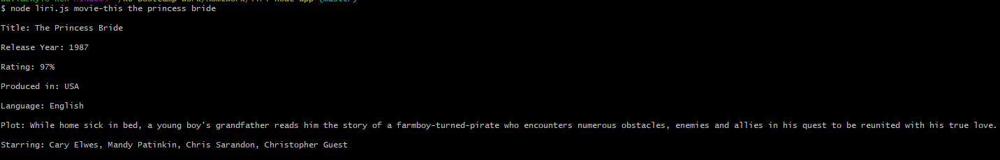
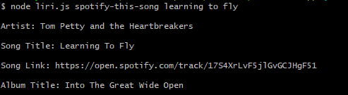
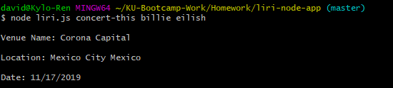
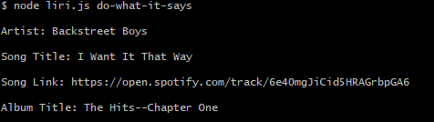

# liri-node-app

## About LIRI-BOT

The all-in-one search engine! Are you tired of having to go to three different search engines to find your favorite movies, favorite songs, and where your favorite musicians will be next performing live?! Well, now you can get all those answers in one place, your CLI!

## How To Use:

1. To search for a movie:
    Use the command "node liri.js movie-this" followed by the movie title of your choice.
    
    format: 

    **Returns:**
        a. Title
        b. Release Year
        c. Rating
        d. Country Produced in
        e. Language Filmed in
        f. Plot

2. To search for a song: 
    Use the command "node liri.js spotify-this-song" followed by the song title of your choice.
    
    format: 

    **Returns:**
        a. Artist
        b. Song Title
        c. Spotify Link
        d. Album Title
        
3. To search for a concert:
    Use the command "node liri.js concert-this" followed by the music artist of your choice.
    
    format: 

    **Returns:**
        a. Venue Name
        b. Location
        c. Date

4. To search using the commands contained within the random.txt file:
    Use the command "node liri.js do-what-it-says"
    The command in the random.txt file can be changed to produce a different search query.
    
    format: 

    **Returns**
        Results are based on what command is used in the .txt file.**

**Technology Used**
    * NPM packages for Spotify 
    * OMDB API
    * Bands-in-Town API
    * Axios

*Important*
    * User will have to provide their own keys in order to access the Spotify command.
    * Sign up for a Spotify API here <https://developer.spotify.com/my-applications/#!/>